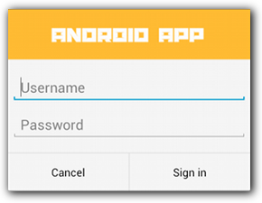

# Alert Dialog 用法

## 构建提醒对话框

对话框一般都通过<code> AlertDialog </code> 类构建各种对话框设计，并且该类通常是您需要的唯一对话框类。<code>AlertDialog</code>有三个区域：


1. 标题

   这是可选项，只应在内容区域被详细消息、列表或自定义布局占据时使用。 如需陈述的是一条简单消息或问题（如图 1 中的对话框），则不需要标题。

2. 内容区域

   它可以显示消息、列表或其他自定义布局。

3. 操作按钮

   对话框中的操作按钮不应超过三个。

<code>AlertDialog.Builder</code> 类似一个工厂类， 提供API用来设计对话框规格(布局，按钮，功能等），然后通过<code>AlertDialog.Builder.create()</code> 来创建新的对话框.

构建<code>AlertDialog.Builder</code> 代码如下

```java
// 1. 初始化 AlertDialog.Builder， 参数为所依附的Activity
AlertDialog.Builder builder = new AlertDialog.Builder(getActivity());

// 2. 通过一系列的set函数设计对话框内容
builder.setMessage(R.string.dialog_message) // 内容区域显示的文字
       .setTitle(R.string.dialog_title); //对话框标题

// 3. 获得对话框实例
AlertDialog dialog = builder.create();
```


## 添加按钮

通过 set...Button()` 方法添加按钮. 该方法需要两个参数，一个按钮标题（由[字符串资源](https://developer.android.com/guide/topics/resources/string-resource.html?hl=zh-cn)提供）和一个 `DialogInterface.OnClickListener`监听器，后者用于定义用户按下该按钮时执行的操作。

您可以添加三种不同的操作按钮：

- 肯定

  您应该使用此按钮来接受并继续执行操作（“确定”操作）。

- 否定

  您应该使用此按钮来取消操作。

- 中性

  您应该在用户可能不想继续执行操作，但也不一定想要取消操作时使用此按钮。 它出现在肯定按钮和否定按钮之间。 例如，实际操作可能是“稍后提醒我”。

对于每种按钮类型，您只能为 `AlertDialog` 添加一个该类型的按钮。也就是说，您不能添加多个“肯定”按钮。

使用代码如下

```Java
AlertDialog.Builder builder = new AlertDialog.Builder(getActivity());
// 添加按钮
builder.setPositiveButton(R.string.ok, new DialogInterface.OnClickListener() {
           public void onClick(DialogInterface dialog, int id) {
               // 确认按钮动作
           }
       });
builder.setNegativeButton(R.string.cancel, new DialogInterface.OnClickListener() {
           public void onClick(DialogInterface dialog, int id) {
               // 否定按钮动作
           }
       });
// Set other dialog properties
...

// Create the AlertDialog
AlertDialog dialog = builder.create();
```


## 添加列表

可通过 `AlertDialog` API 提供三种列表：

- 传统单选列表
- 永久性单选列表（单选按钮）
- 永久性多选列表（复选框）

### 添加传统单选列表

要想创建下图所示的单选列表，请使用 `setItems()` 方法：

```java
AlertDialog.Builder builder = new AlertDialog.Builder(getActivity());
    builder.setTitle(R.string.pick_color)
           .setItems(R.array.colors_array, new DialogInterface.OnClickListener() {
               public void onClick(DialogInterface dialog, int which) {
               // The 'which' argument contains the index position
               // of the selected item
           }
    });
    return builder.create();
```


由于列表出现在对话框的内容区域，因此对话框无法同时显示消息和列表，您应该通过 `setTitle()` 为对话框设置标题。要想指定列表项，请调用`setItems()` 来传递一个数组。或者，您也可以使用 `setAdapter()` 指定一个列表。 这样一来，您就可以使用 `ListAdapter` 以动态数据（如来自数据库的数据）支持列表。使用上述方式，触摸列表项对话框会消失，除非您使用的是下列其中一种永久性选择列表。

### 添加永久性多选列表或单选列表

要想添加多选项（复选框）或单选项（单选按钮）列表，请分别使用 `setMultiChoiceItems()`或 `setSingleChoiceItems()` 方法。

例如，以下示例展示了如何创建下图 所示的多选列表，将选定项保存在一个 `ArrayList` 中：


```java
@Override
public Dialog onCreateDialog(Bundle savedInstanceState) {
    mSelectedItems = new ArrayList();  // Where we track the selected items
    AlertDialog.Builder builder = new AlertDialog.Builder(getActivity());
    // Set the dialog title
    builder.setTitle(R.string.pick_toppings)
    // Specify the list array, the items to be selected by default (null for none),
    // and the listener through which to receive callbacks when items are selected
           .setMultiChoiceItems(R.array.toppings, null,
                      new DialogInterface.OnMultiChoiceClickListener() {
               @Override
               public void onClick(DialogInterface dialog, int which,
                       boolean isChecked) {
                   if (isChecked) {
                       // If the user checked the item, add it to the selected items
                       mSelectedItems.add(which);
                   } else if (mSelectedItems.contains(which)) {
                       // Else, if the item is already in the array, remove it
                       mSelectedItems.remove(Integer.valueOf(which));
                   }
               }
           })
    // Set the action buttons
           .setPositiveButton(R.string.ok, new DialogInterface.OnClickListener() {
               @Override
               public void onClick(DialogInterface dialog, int id) {
                   // User clicked OK, so save the mSelectedItems results somewhere
                   // or return them to the component that opened the dialog
                   ...
               }
           })
           .setNegativeButton(R.string.cancel, new DialogInterface.OnClickListener() {
               @Override
               public void onClick(DialogInterface dialog, int id) {
                   ...
               }
           });

    return builder.create();
}
```

尽管传统列表和具有单选按钮的列表都能提供“单选”操作，但如果您想持久保存用户的选择，则应使用 `setSingleChoiceItems()`。也就是说，如果稍后再次打开对话框时系统应指示用户的当前选择，那么您就需要创建一个具有单选按钮的列表

## 创建自定义布局

如果您想让对话框具有自定义布局，请创建一个布局，然后通过调用 `AlertDialog.Builder` 对象上的 `setView()` 将其添加到 `AlertDialog`。默认情况下，自定义布局会填充对话框窗口，但您仍然可以使用 `AlertDialog.Builder` 方法来添加按钮和标题。setView()既可以添加自定义布局，也可以仅仅创建一个'view'实例， 比如`NumberPicker`或者 `TimePicker`, 添加的view将入填满内容区域.

默认情况下，自定义布局会填充对话框窗口，但您仍然可以使用 `AlertDialog.Builder` 方法来添加按钮和标题。

```java
@Override
public Dialog onCreateDialog(Bundle savedInstanceState) {
    AlertDialog.Builder builder = new AlertDialog.Builder(getActivity());
    // Get the layout inflater
    LayoutInflater inflater = getActivity().getLayoutInflater();

    // Inflate and set the layout for the dialog
    // Pass null as the parent view because its going in the dialog layout
    builder.setView(inflater.inflate(R.layout.dialog_signin, null))
    // Add action buttons
           .setPositiveButton(R.string.signin, new DialogInterface.OnClickListener() {
               @Override
               public void onClick(DialogInterface dialog, int id) {
                   // sign in the user ...
               }
           })
           .setNegativeButton(R.string.cancel, new DialogInterface.OnClickListener() {
               public void onClick(DialogInterface dialog, int id) {
                   LoginDialogFragment.this.getDialog().cancel();
               }
           });
    return builder.create();
}
```



```xml
<LinearLayout xmlns:android="http://schemas.android.com/apk/res/android"
    android:orientation="vertical"
    android:layout_width="wrap_content"
    android:layout_height="wrap_content">
    <ImageView
        android:src="@drawable/header_logo"
        android:layout_width="match_parent"
        android:layout_height="64dp"
        android:scaleType="center"
        android:background="#FFFFBB33"
        android:contentDescription="@string/app_name" />
    <EditText
        android:id="@+id/username"
        android:inputType="textEmailAddress"
        android:layout_width="match_parent"
        android:layout_height="wrap_content"
        android:layout_marginTop="16dp"
        android:layout_marginLeft="4dp"
        android:layout_marginRight="4dp"
        android:layout_marginBottom="4dp"
        android:hint="@string/username" />
    <EditText
        android:id="@+id/password"
        android:inputType="textPassword"
        android:layout_width="match_parent"
        android:layout_height="wrap_content"
        android:layout_marginTop="4dp"
        android:layout_marginLeft="4dp"
        android:layout_marginRight="4dp"
        android:layout_marginBottom="16dp"
        android:fontFamily="sans-serif"
        android:hint="@string/password"/>
</LinearLayout>
```

要扩展 `DialogFragment` 中的布局，请通过 `getLayoutInflater()` 获取一个 `LayoutInflater` 并调用 `inflate()`，其中第一个参数是布局资源 ID，第二个参数是布局的父视图。然后，您可以调用 `setView()` 将布局放入对话框。

```java
@Override
public Dialog onCreateDialog(Bundle savedInstanceState) {
    AlertDialog.Builder builder = new AlertDialog.Builder(getActivity());
    // Get the layout inflater
    LayoutInflater inflater = getActivity().getLayoutInflater();

    // Inflate and set the layout for the dialog
    // Pass null as the parent view because its going in the dialog layout
    builder.setView(inflater.inflate(R.layout.dialog_signin, null))
    // Add action buttons
           .setPositiveButton(R.string.signin, new DialogInterface.OnClickListener() {
               @Override
               public void onClick(DialogInterface dialog, int id) {
                   // sign in the user ...
               }
           })
           .setNegativeButton(R.string.cancel, new DialogInterface.OnClickListener() {
               public void onClick(DialogInterface dialog, int id) {
                   LoginDialogFragment.this.getDialog().cancel();
               }
           });
    return builder.create();
}
```

> 提示：**如果您想要自定义对话框，可以改用对话框的形式显示 `Activity`，而不是使用 `Dialog` API。 只需创建一个 Activity，并在 [``](https://developer.android.com/guide/topics/manifest/activity-element.html?hl=zh-cn) 清单文件元素中将其主题设置为 `Theme.Holo.Dialog`：
>
> 

```
<activity android:theme="@android:style/Theme.Holo.Dialog" >
```

> 就这么简单。Activity 现在会显示在一个对话框窗口中，而非全屏显示


## 将事件传递回对话框的宿主


## Reference：

https://developer.android.com/guide/topics/ui/dialogs.html?hl=zh-cn 