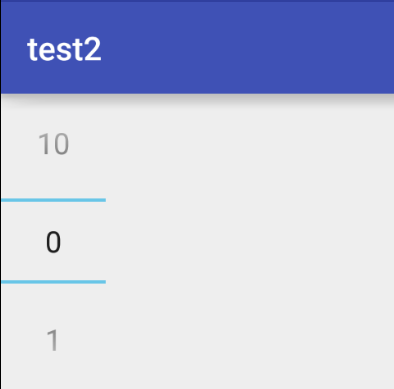
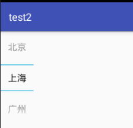

# NumberPicker 使用方法

## 基本用法

### 显示数字

如果想有滚动效果，必须设置最大最小值

```
mNumberPicker.setMaxValue(10); //设置最大值
mNumberPicker.setMinValue(0); //设置最小值
mNumberPicker.setValue(5); //设置当前值
int value = mNumberPicker.getValue(); //获取当前值
```

有一点需要注意的数值不能用负数

 

### 显示文字

我们只需要使用一个方法就可以了

```java
public void setDisplayedValues(String[] displayedValues) 
```

具体代码如下

```java
String[] datas = new String[]{"北京","上海","广州","深圳"};
mNumberPicker.setDisplayedValues(datas); //设置文字
mNumberPicker.setMaxValue(datas.length - 1); //设置最大
```

效果如下



### 设置监听

NumberPicker有三个监听分别是OnValueChangeListener、OnScrollListener、Formatter

#### OnValueChangeListener值改变监听

代码如下

```java
mNumberPicker.setOnValueChangedListener(new NumberPicker.OnValueChangeListener() {
        /**
         * 每当选择的值改变时都会调用一次
         * @param oldVal 改变前的值
         * @param newVal 改变后的值
         */
        @Override
        public void onValueChange(NumberPicker picker, int oldVal, int newVal) {
            //做想做的事
        }
    });
```

#### OnScrollListener滑动事件

每当选择的值改变都会调用一次这个方法，选择的值改变也就是显示在中间的那个值改变

OnScrollListener滑动事件
实例代码如下

```java
mNumberPicker.setOnScrollListener(new NumberPicker.OnScrollListener() {
        @Override
        public void onScrollStateChange(NumberPicker view, int scrollState) {
            switch (scrollState){
                case SCROLL_STATE_FLING:
                    //手离开之后还在滑动
                    break;
                case SCROLL_STATE_IDLE:
                    //停止滑动
                    break;
                case SCROLL_STATE_TOUCH_SCROLL:
                    //正在滑动
                    break;
            }
        }
    });
```
滑动事件就是监听控件滑动时的状态 
滑动事件有三个状态

* `SCROLL_STATE_FLING` ——>手离开之后还在滑动
* `SCROLL_STATE_IDLE` ——>停止滑动
* `SCROLL_STATE_TOUCH_SCROLL` ——>正在滑动

#### Formatter监听

用于格式化当前数值

```java
mNumberPicker.setFormatter(new NumberPicker.Formatter() {
	@Override
        public String format(int value) {
            //做一些格式转换
            return "返回转换后要显示的内容";
        }
    });
```
这个监听是用于做一些格式转换的，比如把10以下的数前面加个0显示(01、02、03…..)，也能理解为转换器,下面我会为大家介绍如何利用Formatter监听设置10以下的数前面加0显示。 
我们需要注意一下不能返回空

## 常见问题

### 设置小于10的数前面显示0

设置小于10的数前面显示0 
实现这个效果我们只需要设置Formatter监听，让小于10的数前面加个0再输出

```java
mNumberPicker.setMaxValue(20);
mNumberPicker.setMinValue(0);
mNumberPicker.setValue(0);

mNumberPicker.setFormatter(new NumberPicker.Formatter() {
    @Override
    public String format(int value) {
            String data;
            if (value < 10) {
                data = "0" + value;//让小于10的数前面加个0再输出
            } else {
                data = String.valueOf(value); //大于10的数就不变
            }

            return data;
        }
    });
```
### 循环滚动

要设置是否循环滚动只需要使用一个方法就可以了

```java
mNumberPicker.setWrapSelectorWheel(true); //设置循环滚动
```

设置false代表不循环滚动，true代表循环滚动 

>  注意
>
> * 一定要设置好最大值才有效果
> * 最大值必须大于等于3


### 禁止编辑

当我们用手指点一下显示的数值会发现竟然可以输入，有些时候我们需要禁止输入，该怎么办呢？我介绍两种常用的方法一种是用在代码里设置，一种是在xml里面设置。 
可以编辑的NumberPicker

#### java代码中设置

只需要使用一个方法就可以了

```java
mNumberPicker.setDescendantFocusability(NumberPicker.FOCUS_BLOCK_DESCENDANTS); //禁止输入
```

#### xml中设置

设置NumberPicker的属性

```xml
android:focusable="true"
android:focusableInTouchMode="true"
```

这样就可以禁止输入了

### 改变字体颜色、字体大小，改变分割线颜色和隐藏分割线

很遗憾NumberPicker没有提供修改字体颜色和字体大小的方法，不过我们可以继承NumberPicker实现需求，代码并不复杂，只是多写了几行代码，其他代码复制粘贴就好了。

修改分割线需要通过反射获得相应的类，然后进行就修改

    package com.my.numberpickertest;
    import android.content.Context;
    import android.graphics.Color;
    import android.util.AttributeSet;
    import android.view.View;
    import android.view.ViewGroup;
    import android.widget.EditText;
    import android.widget.NumberPicker;
    
    public class MyNumberPicker extends NumberPicker {
    public MyNumberPicker(Context context) {
        super(context);
    }
    
    public MyNumberPicker(Context context, AttributeSet attrs) {
        super(context, attrs);
    }
    
    public MyNumberPicker(Context context, AttributeSet attrs, int defStyleAttr) {
        super(context, attrs, defStyleAttr);
    }


```java
@Override
public void addView(View child) {
    super.addView(child);
    updateView(child);
}

@Override
public void addView(View child, int index, ViewGroup.LayoutParams params) {
    super.addView(child, index, params);
    updateView(child);
}

@Override
public void addView(View child, ViewGroup.LayoutParams params) {
    super.addView(child, params);
    updateView(child);
}

/**
 * 修改字的大小和颜色
 */
private void updateView(View view){
    if( view instanceof EditText){
        EditText editText = (EditText) view;
        editText.setTextColor(Color.parseColor("#00ff00")); //修改字的颜色
        editText.setTextSize(30);//修改字的大小
    }
}
}
```

## Reference

http://blog.csdn.net/qq1137830424/article/details/52597371