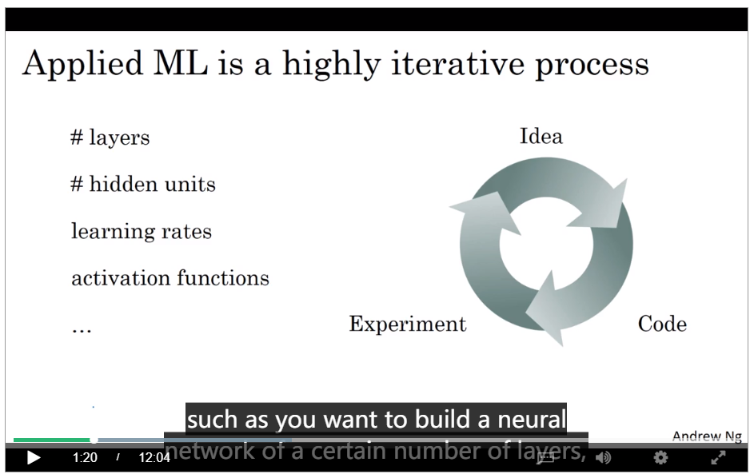

# Improving Deep Neural Networks: Hyperparameter tuning, Regularization and Optimiztion

When we create our model, we have to decide the hyperparameters in order to improve the performence of our model, the possible hypermaters could be:

- Number of layers
- Number of hidden units
- Learning rate
- activation functions

It is very difficult to guess the best choic of hyperparameters 

## How to splite data into  Train/dev/test

We often splite the data into train/dev/test set. The test set.

Train set used to train the model.
Dev set(hold-out cross validation set) used to test the model's performence and compare different algorithms.
Test set used to test the model and get unbiased estimate.

- Small dataset : 
    60%/20%/20% or 70%/30%
- Big dataset :
    98%/1%/1%

The test set and dev set should come from the same distribution. In some times, the test set is not necessary.

## Bias-Variance trade-off

High Bias estimator means the model can not fit well the training set. So the model is underfitting the data.
High variance means the model is over fitting. This estimator is complexe enough to fit the train data but it don't work well
in test set.
A estimator could be high bias and high variance at the same time. In this condition, the estimator is complexe enough but
it still don'tt work well in the train set.

## Basic Recipe for Machine Learning

### High Bias

Estimator doesn't work well in the train set.
Measure:

- User more hidden units
- Add more hidden layers
- Train longer
- Try another architecture of neuro network

### High variance

Estimator doesn't work well for the test set.
Mesure:

- Use more data to train our model
- Regularization
- Find new neuro networl architecture

Firstly, you have to get rid of high bias problem by fitting or overfitting train data, and then we try to resolve the high variance problem.
We can find we use different approche to resolve the two problems. So we can increase one without hurt another one.

## Regularization

Regularization could prevent the overfitting.
If the parameters W very small, so the Z will become relatively small. So the Z will take on a very small range of values.
So the activation function **tanh** will be relatively linear. So the neural network will be computing something not too far from linear function.

If we add regularization, the cost function $J$ will decrease monotonically on very single elevation. Otherwise, not. It is very useful for debug.(But in tensorflow palyground, this phenomenon is not very evident.)

## Dropout regularization

We set some probability of eliminationg a node in neural network for each sample.So we train our sample with deminished network. So the network become more simple and prevent the overfitting.

Don't not use dropout at test time.

## Other regularization methodes

- Data augmentation.
- **Early stopping** When the network start to overfit the dataset, wo stop to train our model. It didn't  recommanded. It could be used to save time.So we just ust it when we try to find best hyperparameters. 

##  Normalizing inputs

Normalizing input features could speed up training.

## Initialization for Deep Nerworks

If the W is more than 1, the activations will increase exponentially, if the W is less than 1, he activations will decrease exponentially. 

- General
  
     $$W^{[l]} = np.random.randn(shape) * \sqrt{\frac{2}{n^{[l-1]}}}$$

- For **tanh** activation function - Xavier initialization
  $$\sqrt{\frac{1}{n^{[l-1]}}} $$

- $$\sqrt{\frac{2}{n^{[l-1]}+n^{[l]}}}$$