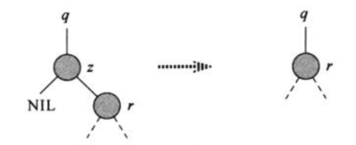
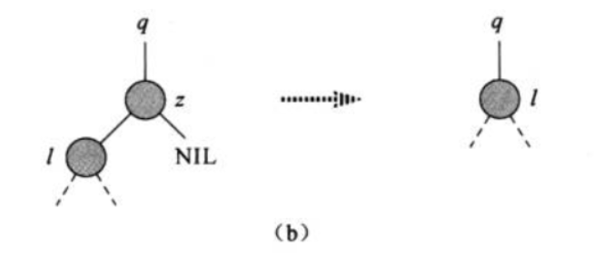
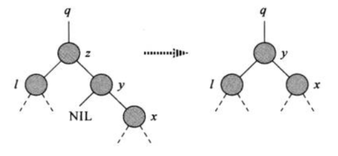
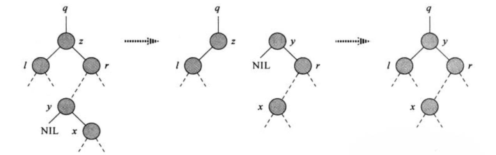

<!--
 * @description:  
 * @author: ZHU Fangda
 * @Date: 2019-11-24 14:00:44
 * @LastEditors: ZHU Fangda
 * @LastEditTime: 2019-11-26 14:44:45
 -->

# 二叉搜索树(Binary Search Tree)
- [二叉搜索树(Binary Search Tree)](#%e4%ba%8c%e5%8f%89%e6%90%9c%e7%b4%a2%e6%a0%91binary-search-tree)
  - [相关概念](#%e7%9b%b8%e5%85%b3%e6%a6%82%e5%bf%b5)
  - [查询二叉树](#%e6%9f%a5%e8%af%a2%e4%ba%8c%e5%8f%89%e6%a0%91)
    - [查找(Search)](#%e6%9f%a5%e6%89%besearch)
    - [最大关键字元素何最小关键字元素](#%e6%9c%80%e5%a4%a7%e5%85%b3%e9%94%ae%e5%ad%97%e5%85%83%e7%b4%a0%e4%bd%95%e6%9c%80%e5%b0%8f%e5%85%b3%e9%94%ae%e5%ad%97%e5%85%83%e7%b4%a0)
    - [后继和前驱](#%e5%90%8e%e7%bb%a7%e5%92%8c%e5%89%8d%e9%a9%b1)
  - [插入和删除](#%e6%8f%92%e5%85%a5%e5%92%8c%e5%88%a0%e9%99%a4)
    - [插入](#%e6%8f%92%e5%85%a5)
    - [删除](#%e5%88%a0%e9%99%a4)
  - [随机构建二叉树](#%e9%9a%8f%e6%9c%ba%e6%9e%84%e5%bb%ba%e4%ba%8c%e5%8f%89%e6%a0%91)
  - [二叉树遍历](#%e4%ba%8c%e5%8f%89%e6%a0%91%e9%81%8d%e5%8e%86)
    - [前序遍历](#%e5%89%8d%e5%ba%8f%e9%81%8d%e5%8e%86)
    - [中序遍历](#%e4%b8%ad%e5%ba%8f%e9%81%8d%e5%8e%86)
    - [后续遍历](#%e5%90%8e%e7%bb%ad%e9%81%8d%e5%8e%86)


## 相关概念

**定义** 二叉搜索树是一颗组织数据的**二叉树**。 对于每一个节点， 其左子树的元素都小于该节点元素， 其右子树的元素都大于该节点元素。

**二叉树的性质** 设$x$是二叉搜索树中的一个结点.如果**y**是**x**左子树的一个结点, 那么$y.key \leq x.key$.如果$y$是$x$右子树的一个结点, 那么$y.key \geq x.key$.

**二叉树结构** 二叉树可由链表数据来表示:

```java
class BinarySearchTree<T>{
  T tree;
  TreeNode left;
  TreeNode right;
  TreeNode parent;
}
```

**二叉搜索树的操作** 二叉搜索书的常见操作有:

- SEARCH
- MINIUM
- MAXIUM
- PREDECESSOR
- SUCCESSOR
- INSERT
- DELETE

二叉搜索树上的基本操作所花费的时间与这棵树的高度成正比


**二叉树的遍历** 二叉树的遍历分为:

- 深度优先(Depth-first search of binary tree)
  - 前序遍历(preorder tree walk)
  - 中序遍历(Inorder tree walk)
  - 后序遍历(postorder tree walk)
- 广度优先(readth-first search)
  - 层次遍历(level order tree walk)

对于深度遍历其前序,中序与后序取决于根节点的位置.
**前序遍历**先输出根节点关键字, 再前序遍历左右子树.
**中遍遍历**先中序遍历左子树, 然后输出根节点关键字, 最后中序遍历右子树.
**后续遍历**先后续遍历左右子树, 最后输出根节点关键字.

>**定理 12.1** 如果$x$是一个由n个结点子树的根, 那么调用INORDER-TREE-WALK需要$\Theta(n)$时间.

## 查询二叉树

常见的查找二叉树操作有：

- SEARCH
- MINIMUM
- MAWXIMUM
- SUCCESSOR
- PREDECESSOR

上述操作都可在$O(h)$时间内完成。

### 查找(Search)

```JAVA
public boolean search(T value) {
  if (value == null) {
    return false;
  }

  BinaryTreePosition<T> curr = root;
  while (curr != null) {
    if (value.equals(curr.getElem())) {
      return true;
    } else if (value.compareTo(curr.getElem()) < 0) {
      curr = curr.getLeftChild();
    } else {
      curr = curr.getRightChild();
    }
  }

  return false;
}
```

### 最大关键字元素何最小关键字元素

```Java
public T mininum() {
  BinaryTreePosition<T> curr = root;
  if(curr==null){
    return null;
  }
  
  while (curr.getLeftChild() != null) {
    curr = curr.getLeftChild();
  }
  
  return curr.getElem();
}
```

```java
public T maximun() {
  BinaryTreePosition<T> curr = root;
  if(curr==null){
    return null;
  }
  
  while (curr.getRightChild() != null) {
    curr = curr.getRightChild();
  }
  
  return curr.getElem();
}
```

上述操作在高度为h的树上均能$O(h)$时间内执行完， 因为与TREE-SEARCH一样， 他们所遇到的结点均形成一条从树根向下的简单路径。
需要注意的是， 最小元素未必位于子叶位置。它可以拥有一个右儿子。
同理， 最大元素未必位于子叶位置。它可以拥有一个左儿子。
### 后继和前驱

所谓后继与前驱，指的是在中序遍历中指定元素的前一个元素与后一个元素。

```java
public BinaryTreePosition<T> successor(BinaryTreePosition<T> node) {
  if (node == null) {
    return null;
  }

  if (node.hasRightChild()) {
    return mininum(node.getRightChild());
  }

  BinaryTreePosition<T> curr = node;
  BinaryTreePosition<T> parent = node.getParent();

  while (parent != null && parent.getRightChild() == curr) {
    curr = curr.getParent();
    parent = curr.getParent();
  }

  return parent;
}
```

对于寻找当前结点x的后继， 有两种情况：

1. 当前结点$x$￥的右子树不为空， 那么应当返回当前结点右子树最左边的子叶结点，也就是右子树最小的结点。
2. 如果当前点$x$的右子树为空， 那么又可以分为两种情况：
   1. 当前结点$x$为父节点$y$左子树，则返回父节点。
   2. 当前结点$x$为父结点$y$右子树，那么应该寻找一个祖先，该祖先的的左子树也是该结点的祖先。
   我们可以吧这两种情况合并。即沿着该结点向上寻找。curr代表当前结点， y代表父节点，如果当前节点是父节点的左儿子， 则返回父节点。反之，当前结点必为父节点的右儿子， 那么当前结点curr变为父节点，y变为curr的父节点，继续寻找。如果发现父节点也为空， 那么代表已经到达根结点， 这种情况下后继不存为。

```java
public BinaryTreePosition<T> predecessor(BinaryTreePosition<T> node) {
  if (node == null) {
    return null;
  }

  if (node.hasLeftChild()) {
    return maximun(node.getLeftChild());
  }

  BinaryTreePosition<T> curr = node;
  BinaryTreePosition<T> parent = node.getParent();

  while(parent !=null && parent.getLeftChild()==curr){
    curr = parent;
    parent = curr.getParent();
  }
  
  return parent;
}
```

对于寻找当前结点x的前驱， 有两种情况：

1. 当前结点$x$的左子树不为空， 那么应当返回当前结点左子树最右边的子叶结点，也就死左子树最小的结点。
2. 如果当前点$x$的左子树为空， 那么又可以分为两种情况：
   1. 当前结点$x$为父节点$y$右子树，则返回父节点。
   2. 当前结点$x$为父结点$y$左子树，那么应该寻找一个祖先，该祖先的的右子树也是该结点的祖先。
   我们可以吧这两种情况合并。即沿着该结点向上寻找。curr代表当前结点， y代表父节点，如果当前节点是父节点的右儿子， 则返回父节点。反之，当前结点必为父节点的左儿子， 那么当前结点curr变为父节点，y变为curr的父节点，继续寻找。如果发现父节点也为空， 那么代表已经到达根结点， 这种情况下后继不存在。

对于上述算法， 在运行过程中或者以当前结点沿着一条简单路径向下， 或者沿着一条简单路径向上， 孤儿最坏情况是$\Theta(max(h_{root}, h_{root}-h_{node}))$。 所以其运行时间也是$\Theta(h)$.

**定理 12.2** 在一棵高为h的二叉搜索树上， 动态集合上的操作SEARCH, MINUMUM, MAXIMUM, SUCCESSOR和PREDECESSOR可以在$\Theta(h)$时间内完成。


## 插入和删除

### 插入

```java
public void insert(T t) {
  BinaryTreePosition<T> node = new BinaryTreeNode<>(t);

  BinaryTreePosition<T> curr = root;
  BinaryTreePosition<T> parent = root;
  
  while (curr != null) {
    parent = curr;
    if (t.compareTo(curr.getElem()) <= 0) {
      curr = curr.getLeftChild();
    } else {
      curr = curr.getRightChild();
    }
  }

  if (t.compareTo(parent.getElem()) <= 0) {
    parent.attachLeft(node);
  } else {
    parent.attachRight(node);
  }
}
```

插曲算法相对简单， 每次插入的其实都是数的子叶结点， 所以其寻找路径是一条从更结点出发到子叶结点的简单路径， 所以其算法复杂度是$O(h)$。因此该算法首先寻找到插入位置的父节点, 然后插入该节点。因为在寻找过程中， 并没有存储相应信息来获知插入结点为父节点的左孩子还是右孩子。 所以插入前还需要再判断一次插入位置。

### 删除

从一棵二叉树中删除一个结点$z$可以分为三种情况：

1. 如果$z$没有孩子结点， 那么简单的将它删除.
2. 如果$z$只有一个孩子， 只需要用这个孩子代替被删除的结点即可。


3. 如果$z$有两个孩子, 那我们寻找$z$的后继，用$z$的后继来替代$z$。因为$z$有两个孩子，所以其后继必然在右子树且其后继$y$的左子树必然为0，且他的key必然大于$z$的左子树的所有元素。所以可以用$y$来替代$z$的位置， 将$z$的左子树作为$y$的左子树，$y$的右子树替代$y$本来的位置。




为了在二叉搜索树内移动子树， 定义一个子过程$TRANSPLANT$， 它是用一棵子树替换另外一棵子树并成为双亲孩子的结点。该过程包含两个参数， u跟v， 他的作用是用v替代u。

```python
def TRANSPLANT(T, u, v):
  # 如果u为根结点，直接替换
  if u.p == NIL:
    T.root = u
  # 如果u为父节点的左孩子， v替换u父节点的左孩子
  elif u==u.p.left:
    u.p.left = v
  # 如果u为父节点的右孩子， v替换u父节点的右孩子
  else u.p.right = v

  # 更改v父节点的指向
  if v!= NIL:
    v.p = u.p
```

```java
public void removeNode(BinaryTreePosition<T> node) {
  if (node.hasLeftChild() && node.hasRightChild()) {
    BinaryTreePosition<T> suc = successor(node);
    suc.attachLeft(node.getLeftChild());
    if (node.getLeftChild() != suc) {
      transplant(suc, suc.getRightChild());
      suc.attachLeft(node.getLeftChild());
    }  
    transplant(node, suc);
  } else if (node.hasLeftChild()) {
    transplant(node, node.getLeftChild());
  } else {
    transplant(node, node.getRightChild());
  }
}
```

除了寻找后继的复杂度为$O(h)$, 其他步骤均为常数。 所以我们有 

**定理 12.3** 在一棵高度为$h$的二叉搜索树上， 实现动态集合操作 *INSERT* 与 *DELETE* 的运行时间均为 $O(h)$.

## 随机构建二叉树

**定理 12.4** 一颗有$n$个不同关键字的随机构建二叉搜索树的期望高度是$lg(n)$.

## 二叉树遍历

我们主要讨论使用迭代器方法实现二叉树的遍历。 实现迭代器需要实现两个方法**hasNext**与**next**.我们使用curr来存储当前的节点，那么next得作用就是寻找curr节点在该遍历方法中的后继。

### 前序遍历

对于当前节点， 有以下三种情况

1. 当前节点有左儿子， 则后继为当前节点左儿子
2. 当前结点有右儿子， 则后继为当前结点右儿子。
3. 如果当前结点为父节点的左儿子且父节点右儿子存在， 则后继为父节点右儿子
4. 剩下的情况， 当前节点为子叶结点，且没有兄弟。那么我们要在从这个结点到根节点寻找三个结点 $x$,$y$,$z$. 其中$x$为$y$的左儿子， $y$为$x$根结点， 且$y$的右儿子存在，记为$z$. 如果找到则返回$z$.

### 中序遍历

对于当前结点， 有以下几种情况：

1. 如果有右儿子， 返回右儿子中最小元素
2. 从当前节点到根节点中寻找两个结点，$x$与$y$使得$y$是$x$的父节点且$x$是$y$的左儿子。

### 后续遍历

将当前节点初始化为树的左下角。

后续遍历的顺序为先左节点，再兄弟结点，最后输出中间结点。
对于任意结点我们有：

1. 如果树为双亲的左儿子且双亲右儿子存在，则返回双亲右儿子的最边缘结点。
2. 否则返回父节点