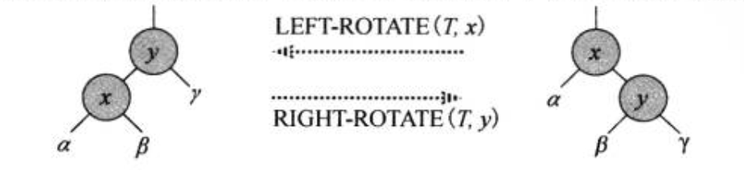

<!--
 * @description:  
 * @author: ZHU Fangda
 * @Date: 2019-11-21 16:06:47
 * @LastEditors: ZHU Fangda
 * @LastEditTime: 2019-11-21 17:16:41
 -->
红黑树

---
- [定义](#%e5%ae%9a%e4%b9%89)
- [红黑树的性质：](#%e7%ba%a2%e9%bb%91%e6%a0%91%e7%9a%84%e6%80%a7%e8%b4%a8)
- [概念：](#%e6%a6%82%e5%bf%b5)
- [树旋转](#%e6%a0%91%e6%97%8b%e8%bd%ac)

## 定义
红黑树是一颗二叉搜索树,它在每个节点上增加一个存储位来表示节点的颜色， 可以是RED或者BLACK。 通过对任何一条从根到叶子的简单路径上各个节点的颜色进行约束， 红黑树确保没有一条路径比其他路径长出两倍， 因而是近似于平衡的。

**二叉搜索树**：
二叉搜索树是一颗组织数据的二叉树。 对于每一个节点， 其左子树的元素都小于该节点元素， 其右子树的元素都大于该节点元素。

## 红黑树的性质：

1. 每个节点或是红色的， 或者是黑色的
2. 根节点是黑色的
3. 每个叶节点都是NIL且是黑色的
4. 如果一个结点是红色的， 则他的两个子节点都是黑色的
5. 对于每个节点， 从该节点到其所有后代叶节点的简单路径上， 均包含相同数目的黑色节点。

## 概念：
**内部节点（internal node）**： 至少拥有一个孩子的节点称为内部节点。
**子叶**： 没有孩子的节点称为子叶

黑高（black-height）：从节点x（不包含该节点）出发，到达任意一个叶节点的任意一条简单路径上的黑色节点个数称为该节点的黑高。子叶节点的黑高为0.
性质5保证黑高的存在

定理：
引理0： 任一节点x为根的子树， 则至少含有2^bh(x)-1个内部节点
引理1： 一颗有n个内部节点的红黑树的高度至多为2lg(n+1)

## 树旋转

