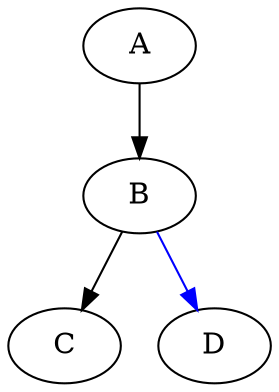

<!--
 * @description:  
 * @author: ZHU Fangda
 * @Date: 2019-11-21 16:06:47
 * @LastEditors: ZHU Fangda
 * @LastEditTime: 2019-11-27 16:48:14
 -->
# 红黑树

- [红黑树](#%e7%ba%a2%e9%bb%91%e6%a0%91)
  - [定义](#%e5%ae%9a%e4%b9%89)
  - [红黑树的性质：](#%e7%ba%a2%e9%bb%91%e6%a0%91%e7%9a%84%e6%80%a7%e8%b4%a8)
  - [概念：](#%e6%a6%82%e5%bf%b5)
  - [树旋转](#%e6%a0%91%e6%97%8b%e8%bd%ac)
  - [插入](#%e6%8f%92%e5%85%a5)

## 定义
红黑树是一颗二叉搜索树,它在每个节点上增加一个存储位来表示节点的颜色， 可以是RED或者BLACK。 通过对任何一条从根到叶子的简单路径上各个节点的颜色进行约束， 红黑树确保没有一条路径比其他路径长出两倍， 因而是近似于平衡的。

**二叉搜索树**：


## 红黑树的性质：

1. 每个节点或是红色的， 或者是黑色的
2. 根节点是黑色的
3. 每个叶节点都是NIL且是黑色的
4. 如果一个结点是红色的， 则他的两个子节点都是黑色的
5. 对于每个节点， 从该节点到其所有后代叶节点的简单路径上， 均包含相同数目的黑色节点。

## 概念：
**内部节点（internal node）** 至少拥有一个孩子的节点称为内部节点。
**子叶** 没有孩子的节点称为子叶

>**黑高（black-height）** 从节点x（不包含该节点）出发，到达任意一个叶节点的任意一条简单路径上的黑色节点个数称为该节点的黑高。子叶节点的黑高为0.
性质5保证黑高的存在

**定理：**
> 引理0： 任一节点$x$为根的子树， 则至少含有$2^{bh(x)}-1$个内部节点
> 引理1： 一颗有n个内部节点的红黑树的高度至多为$2\lg(n+1)$

## 树旋转
通过旋转操作，二叉搜索树的性质保持不变， 所以旋转不会改变中序遍历的结果， 只会改变当前的节点的高度。 LEAF-ROTATE与RIGHT-ROTATE只会与当前节点的左儿子或者右儿子交换位置， 并改变当前结点的深度。

向右旋转，会用左儿子代替当前节点的位置，并让当前节点称为左儿子的右儿子， 右二子的左儿子称为当前节点的左儿子


```java
 public void rightRotation(BinaryTreePosition<T> node) throws IllegalArgumentException {
    if (node.getLeftChild() == null) {
      throw new IllegalArgumentException("Illegal Exception. Can not do lefr roation");
    }

    BinaryTreePosition<T> parent = node.getParent();
    BinaryTreePosition<T> y = node.getRightChild();

    // 将y结点与node的父节点相连
    if (node.isLeftChild()) {
      parent.attachLeft(y);
    } else {
      parent.attachRight(y);
    }

    node.attachRight(y.getLeftChild());
    y.attachLeft(node);

  }
```

```java
  public void leftRotation(BinaryTreePosition<T> node) throws IllegalArgumentException{
    if (node.getRightChild() == null) {
      throw new IllegalArgumentException("Illegal Exception. Can not do left roation");
    }

    BinaryTreePosition<T> parent = node.getParent();
    BinaryTreePosition<T> y = node.getRightChild();

    // 将y结点与node的父节点相连
    if (node.isLeftChild()) {
      parent.attachLeft(y);
    } else {
        parent.attachRight(y);
    }

    node.attachRight(y.getLeftChild());
    y.attachLeft(node);

  }
```

## 插入
我们可以在$O(\lg n)$时间内完成向一棵含$n$个结点的红黑树中插入一个新节点。 微课做到这一点， 利用**TREE-INSERT**过程的一个略作修改的版本来讲结点$z$插入树$T$内。 就好像$T$是一颗普通的二叉搜索树一样，然后将$z$着色为红色。 为了保证红黑性质能继续保持， 我们调用一个辅助程序**RB-INSERT-FIXUP**来对结点重新着色并旋转。调用**BR-INSERT(T,z)**在红黑树T内插入结点$z$。





```
RB-INSERT(T, z):
    y = T.nil
    x = T.root
    while x!=T.nil:
        y = x
        if z.key < x.key:
            x = x.left
        else
            x = x.right
    z.p = y
    if y == T.nil:
        T.root = z
    else if z.key<y.key:
        y.left = z
    else:
        y.right = z
    z.left = T.nil
    z.right = T.nil
    z.color = RED
    BR-INSERT-FIXUP(T, z)
```

